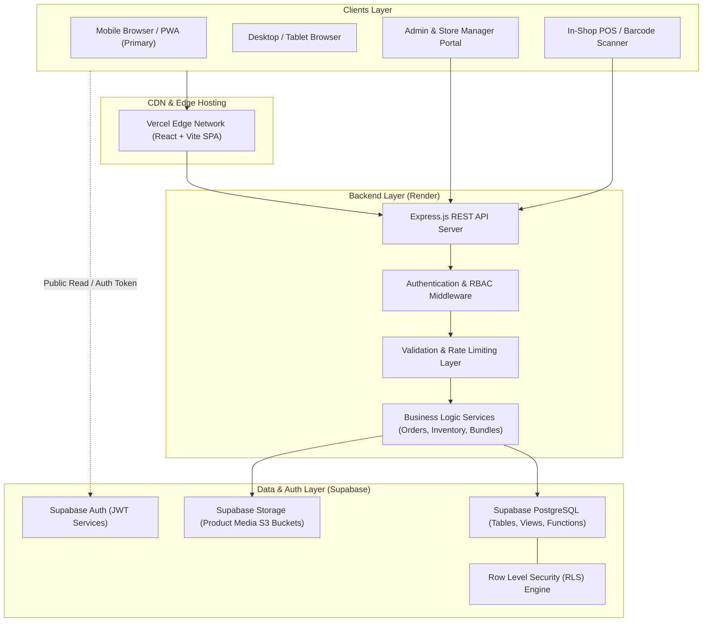
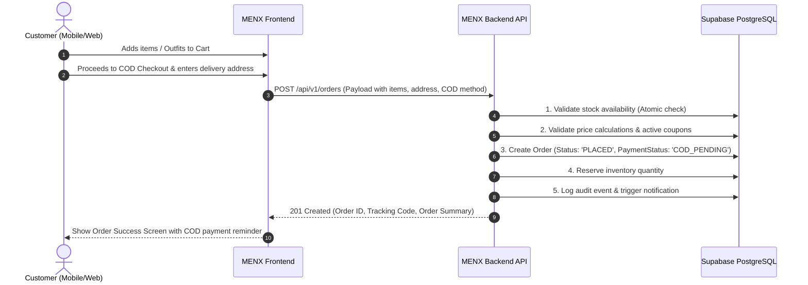

# MENX System Architecture & Design Document

## 1. Executive Summary

MENX is a hybrid retail-and-online men's fashion ecosystem designed with a mobile-first philosophy. The architecture ensures high performance, real-time inventory consistency across physical and digital storefronts, bulletproof security, and a frictionless Cash-on-Delivery (COD) customer checkout flow.

---

## 2. High-Level System Architecture



---

## 3. Frontend Architecture

### 3.1 Technology Stack
- **Framework**: React 18+ (SPA with Vite bundler)
- **Styling**: Tailwind CSS (Utility-first with custom design tokens for mobile screens)
- **Icons**: Lucide-react (Lightweight, accessible icon set)
- **State Management**: React Context API + Custom Hooks (Cart, Auth, Wishlist, Notifications)
- **Routing**: React Router DOM (v6+) with protected route guards

### 3.2 Mobile-First Design Principles
1. **Touch Targets & Gestures**: Interactive targets minimum 48x48px, swipeable product galleries, drawer-based navigation and filters.
2. **Bottom Navigation & Quick Action Bar**: Fixed bottom bar on mobile screens for Home, Categories, Outfits, Cart, and Account.
3. **Sticky Buy / Add-to-Cart Action Bar**: Sticky mobile checkout CTA on product detail view.
4. **Adaptive Breakpoints**:
   - `xs`: `< 480px` (Compact smartphones)
   - `sm`: `640px` (Large smartphones & phablets)
   - `md`: `768px` (Tablets / iPad Mini)
   - `lg`: `1024px` (Laptops / POS displays)
   - `xl`: `1280px` (High-resolution desktops)

### 3.3 Frontend Folder Structure
```
frontend/
├── index.html
├── vite.config.js
├── tailwind.config.js
├── postcss.config.js
├── .env.example
├── src/
│   ├── main.jsx                  # Application entry point
│   ├── App.jsx                   # Router & root layout
│   ├── index.css                 # Tailwind directives & base styles
│   ├── assets/                   # Static logos, placeholders, vectors
│   ├── components/
│   │   ├── common/               # Buttons, Inputs, Modals, Loaders, Badges
│   │   ├── layout/               # Header, BottomNav, Footer, Sidebar, LayoutWrapper
│   │   ├── storefront/           # ProductCard, OutfitBundleCard, FilterDrawer, Reviews
│   │   ├── checkout/             # CODConfirmation, AddressSelector, OrderSummary
│   │   └── admin/                # InventoryTable, OrderStatusBadge, BarcodeScannerModal
│   ├── pages/
│   │   ├── storefront/           # Home, Shop, ProductDetail, OutfitBuilder, Cart, Checkout
│   │   ├── account/              # Profile, OrderHistory, OrderDetails, Wishlist, Addresses
│   │   └── admin/                # Dashboard, Products, Inventory, Orders, Returns, Customers
│   ├── context/                  # AuthContext, CartContext, WishlistContext, ToastContext
│   ├── hooks/                    # useAuth, useCart, useDebounce, useMediaQuery
│   ├── services/                 # api.js (Axios/Fetch wrapper), supabaseClient.js
│   └── utils/                    # formatters (Currency INR, Dates), validators, constants
```

---

## 4. Backend Architecture

### 4.1 Technology Stack
- **Runtime**: Node.js (v18+ LTS)
- **Framework**: Express.js
- **Database Client**: `@supabase/supabase-js` (with server-side privileged client and client token forwarding)
- **Validation**: Schema-based validation (Zod / Joi) for strict request typing
- **Security Middleware**: `helmet`, `cors`, `express-rate-limit`, `hpp`, `sanitize-html`

### 4.2 Separation of Concerns & Data Flow
1. **Routes**: Define URL paths and link them to middlewares and controller methods.
2. **Middlewares**: Enforce authentication (JWT verification), role checks, rate limiting, and input schema validation.
3. **Controllers**: Parse input, call services, and structure HTTP responses.
4. **Services**: Pure business logic (stock calculation, bundle pricing, return eligibility check, COD confirmation).
5. **Data Layer / Supabase**: Executes transactional queries with RLS safety.

### 4.3 Backend Folder Structure
```
backend/
├── package.json
├── .env.example
└── src/
    ├── server.js                 # HTTP listener & cluster boot
    ├── app.js                    # Express app configuration & middleware pipeline
    ├── config/                   # Supabase client config, env vars loader, constants
    ├── middlewares/
    │   ├── auth.middleware.js    # JWT verification & role validation
    │   ├── validate.middleware.js# Zod/Joi request validation
    │   ├── rateLimit.middleware.js # Endpoint throttling
    │   ├── error.middleware.js   # Centralized error handler
    │   └── audit.middleware.js   # Admin action audit interceptor
    ├── routes/
    │   ├── index.js              # Aggregated API router (/api/v1)
    │   ├── auth.routes.js        # Auth helpers & profile endpoints
    │   ├── product.routes.js     # Public catalog & Admin product CRUD
    │   ├── outfit.routes.js      # Outfit bundles & style sets
    │   ├── cart.routes.js        # Cart validation & price calculations
    │   ├── order.routes.js       # COD order creation & tracking
    │   ├── inventory.routes.js   # Central stock management & POS sync
    │   ├── return.routes.js      # Return/exchange requests & management
    │   ├── coupon.routes.js      # Promo code application & validation
    │   └── admin.routes.js       # Analytics, reports, and audit logs
    ├── controllers/              # Endpoint handlers matching routes
    ├── services/                 # Core business logic modules
    └── utils/                    # Logger, AppError, response helpers
```

---

## 5. Centralized Inventory Model (Retail + Online)

MENX operates a unified stock model where physical retail and online store draw from the same real-time inventory ledger:
- **Variant-Level Tracking**: Each item tracked by SKU and Barcode (EAN-13 / Code-128) based on `Color` + `Size`.
- **Atomic Stock Deductions**: PostgreSQL transactions ensure race conditions are prevented during simultaneous physical POS checkouts and online orders.
- **Stock Statuses**:
  - `In Stock`: Available for both online and retail.
  - `Reserved`: Allocated to active pending COD orders awaiting shipment.
  - `Damaged / Quarantined`: Excluded from sellable count.
  - `Low Stock Threshold`: Configurable trigger for automated reorder reminders to store managers.

---

## 6. Cash on Delivery (COD) Checkout Workflow



---

## 7. Outfit Combinations & Bundling Subsystem

To drive higher average order value (AOV) for men's fashion, MENX introduces a first-class **Outfit Combinations** entity:
- An Outfit consists of 2 to 5 complementary products (e.g., Slim Shirt + Chinos + Leather Loafers + Braided Belt).
- Bundles can have specialized bundle pricing or percentage discounts.
- Stock availability for a bundle is calculated dynamically from the lowest common variant stock of the included items.
- Customers can select individual variant sizes (e.g., Shirt Size L, Pant Size 32, Shoe Size 9) in a single unified mobile drawer before adding the complete outfit to their cart with one tap.
