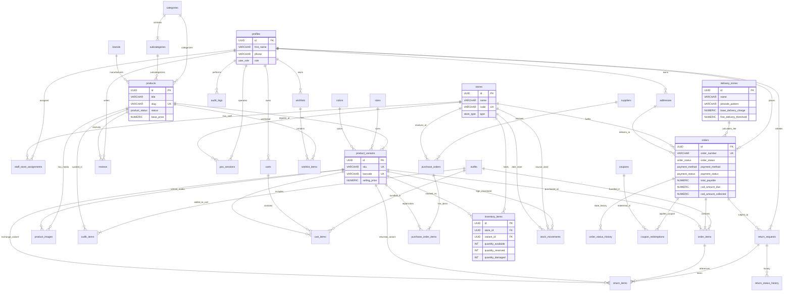

# MENX Complete Entity Relationship Diagram (ERD)

```mermaid
erDiagram
    %% Auth & User Profile
    profiles ||--o{ staff_store_assignments : assigned
    stores ||--o{ staff_store_assignments : has_staff
    profiles ||--o{ addresses : owns
    profiles ||--o{ wishlists : owns
    profiles ||--o{ carts : owns
    profiles ||--o{ orders : places
    profiles ||--o{ reviews : writes
    profiles ||--o{ return_requests : initiates
    profiles ||--o{ audit_logs : performs
    profiles ||--o{ pos_sessions : operates

    %% Catalog & Taxonomy
    categories ||--|{ subcategories : contains
    categories ||--o{ products : categorizes
    subcategories ||--o{ products : subcategorizes
    brands ||--o{ products : manufactures
    products ||--|{ product_variants : has
    sizes ||--o{ product_variants : sizes
    colors ||--o{ product_variants : colors
    products ||--o{ product_images : has_media
    product_variants ||--o{ product_images : variant_media
    products ||--o{ reviews : receives
    products ||--o{ wishlist_items : wishlisted

    %% Outfits
    outfits ||--|{ outfit_items : includes
    products ||--o{ outfit_items : curated_in
    outfits ||--o{ cart_items : bundled_in
    outfits ||--o{ order_items : bundled_in

    %% Suppliers & Purchasing
    suppliers ||--o{ purchase_orders : receives
    stores ||--o{ purchase_orders : receives_at
    purchase_orders ||--|{ purchase_order_items : line_items
    product_variants ||--o{ purchase_order_items : replenishes

    %% Inventory & Movements
    stores ||--o{ inventory_items : holds
    product_variants ||--o{ inventory_items : stocked_as
    product_variants ||--o{ stock_movements : logs_movement
    stores ||--o{ stock_movements : source_store
    stores ||--o{ stock_movements : dest_store

    %% Delivery
    delivery_zones ||--o{ orders : calculates_fee

    %% Shopping Cart & Wishlist
    wishlists ||--o{ wishlist_items : contains
    carts ||--o{ cart_items : contains
    product_variants ||--o{ cart_items : added_to_cart

    %% Orders & COD Fulfillment
    stores ||--o{ orders : fulfills
    addresses ||--o{ orders : delivers_to
    orders ||--|{ order_items : contains
    product_variants ||--o{ order_items : purchased_as
    orders ||--o{ order_status_history : state_history
    orders ||--o{ coupon_redemptions : applies_coupon
    coupons ||--o{ coupon_redemptions : redeemed_in

    %% Returns & Exchanges
    orders ||--o{ return_requests : subject_to
    return_requests ||--|{ return_items : items
    order_items ||--o{ return_items : references
    product_variants ||--o{ return_items : returned_variant
    product_variants ||--o{ return_items : exchange_variant
    return_requests ||--o{ return_status_history : history

    %% Physical POS
    stores ||--o{ pos_sessions : register_at

    %% Entity Attributes Summary
    profiles {
        UUID id PK
        VARCHAR first_name
        VARCHAR phone
        user_role role
    }

    stores {
        UUID id PK
        VARCHAR name
        VARCHAR code UK
        store_type type
    }

    products {
        UUID id PK
        VARCHAR title
        VARCHAR slug UK
        product_status status
        NUMERIC base_price
    }

    product_variants {
        UUID id PK
        VARCHAR sku UK
        VARCHAR barcode UK
        NUMERIC selling_price
    }

    inventory_items {
        UUID id PK
        UUID store_id FK
        UUID variant_id FK
        INT quantity_available
        INT quantity_reserved
        INT quantity_damaged
    }

    delivery_zones {
        UUID id PK
        VARCHAR name
        VARCHAR pincode_pattern
        NUMERIC base_delivery_charge
        NUMERIC free_delivery_threshold
    }

    orders {
        UUID id PK
        VARCHAR order_number UK
        order_status order_status
        payment_method payment_method
        payment_status payment_status
        NUMERIC total_payable
        NUMERIC cod_amount_due
        NUMERIC cod_amount_collected
    }
```
