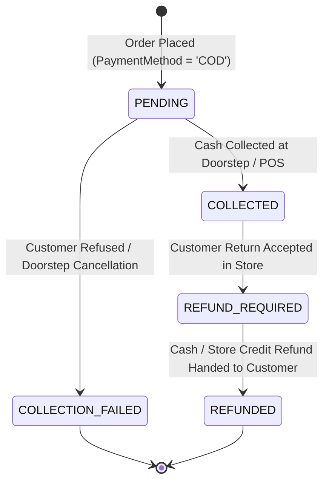

# MENX Cash-on-Delivery (COD) Data Model & Workflow

For Version 1 of MENX, **Cash on Delivery (COD)** is the exclusive customer payment method.

---

## 1. Database-Enforced COD Constraints

The database strictly enforces the COD policy:

```sql
ALTER TABLE orders ADD CONSTRAINT chk_orders_payment_method 
  CHECK (payment_method = 'COD');
```

---

## 2. COD Controlled Payment Lifecycle



| Payment Status | Description | Consistency Constraint Rules |
| :--- | :--- | :--- |
| **`PENDING`** | Order created; cash awaiting collection upon delivery. | `cod_amount_collected = 0.00`, `cod_collected_at IS NULL` |
| **`COLLECTED`** | Customer handed over cash to courier or POS cashier. | `cod_amount_collected = cod_amount_due`, `cod_collected_at IS NOT NULL`, `cod_collected_by IS NOT NULL` |
| **`COLLECTION_FAILED`**| Customer refused payment at doorstep or unreachable. | `cod_amount_collected = 0.00` |
| **`REFUND_REQUIRED`** | Returned item inspected; refund approved by manager. | `cod_amount_collected > 0` (Refund only possible if money collected) |
| **`REFUNDED`** | Cash refund or store credit disbursed to customer. | Processed by store manager with audit entry. |

---

## 3. Financial Integrity & Reconciliation

In `orders`:
- **`subtotal_amount`**: Sum of item line totals.
- **`discount_amount`**: Promo code or bundle discount deduction.
- **`delivery_fee`**: Preserved shipping charge from applicable delivery zone.
- **`total_payable`**: Final net invoice amount:
  $$\text{total\_payable} = \text{subtotal\_amount} - \text{discount\_amount} + \text{delivery\_fee}$$
- **`cod_amount_due`**: Exact currency amount courier must collect (equals `total_payable`).
- **`cod_amount_collected`**: Actual cash handed over.
- **`cod_collected_at`**: Timestamp of cash receipt.
- **`cod_collected_by`**: Courier agent or POS cashier UUID.
