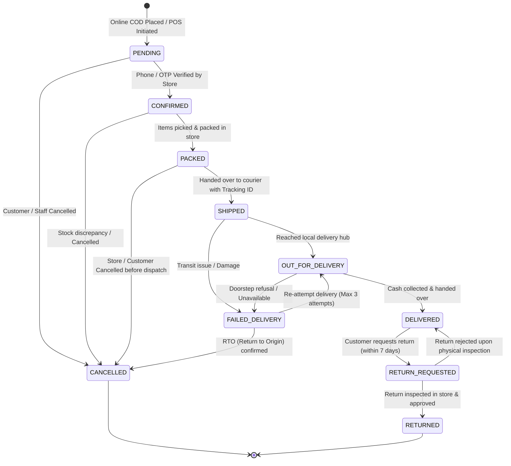

# MENX Order Lifecycle, Delivery Model & Pricing Architecture

This document details the order data model, delivery zone integration, and order status state machine.

---

## 1. Controlled Order Lifecycle State Machine

---

## 2. Allowed Transition Validation Rules

| Current Status | Permitted Next Statuses | Business Trigger |
| :--- | :--- | :--- |
| **`PENDING`** | `CONFIRMED`, `CANCELLED` | Store staff verifies customer phone and address. |
| **`CONFIRMED`** | `PACKED`, `CANCELLED` | Warehouse staff picks variants from shelf and packs parcel. |
| **`PACKED`** | `SHIPPED`, `CANCELLED` | Handed over to courier with tracking number. |
| **`SHIPPED`** | `OUT_FOR_DELIVERY`, `FAILED_DELIVERY` | Courier reaches destination hub. |
| **`OUT_FOR_DELIVERY`**| `DELIVERED`, `FAILED_DELIVERY` | Courier completes delivery and collects cash, or customer absent. |
| **`FAILED_DELIVERY`** | `OUT_FOR_DELIVERY`, `CANCELLED` | Schedule re-attempt or initiate Return-to-Origin. |
| **`DELIVERED`** | `RETURN_REQUESTED` | Customer requests return/exchange via mobile app. |
| **`RETURN_REQUESTED`**| `RETURNED`, `DELIVERED` | Return verified and stock restocked, or rejected. |
| **`CANCELLED`** | *Terminal state* | Reserved stock returned to `quantity_available`. |
| **`RETURNED`** | *Terminal state* | Stock restocked to `quantity_available` or `quantity_damaged`. |

---

## 3. Delivery Model & Rules (`delivery_zones`)

1. **Delivery Zone Entity**:
   - `delivery_zones` table defines regional delivery pricing and estimated timelines based on PIN code patterns.
   - Example Rules:
     - Local Store Zone (`534*`): Base Fee ₹40, Free above ₹799, 1–2 Days.
     - State Standard (`533*`, `530*`, `520*`): Base Fee ₹60, Free above ₹999, 2–4 Days.
     - Rest of India (`*`): Base Fee ₹80, Free above ₹1299, 4–7 Days.

2. **Order-Level Fee Freezing**:
   - When an order is created, the system calculates the fee based on the matching `delivery_zone_id` and subtotal.
   - The fee is frozen in `orders.delivery_fee`.
   - Subsequent changes to delivery zones or pricing rules **never** retroactively alter historical order charges.
