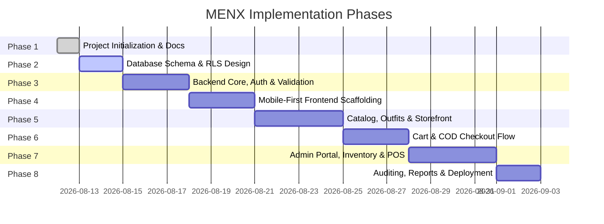

# MENX Phased Development Plan

This document outlines the step-by-step roadmap to build, verify, and deploy the MENX platform in a structured, verifiable, and secure manner.

---

## 🗺️ Roadmap Overview

---

## 📋 Phase Breakdown

### Phase 1: Project Initialization & Architectural Foundation (CURRENT)
- [x] Create clean Git-ready project structure
- [x] Configure root, frontend, and backend `.gitignore`
- [x] Author comprehensive project `README.md`
- [x] Author system architecture documentation (`docs/architecture.md`)
- [x] Author security guidelines & standards (`docs/security.md`)
- [x] Author multi-phase development plan (`docs/development-plan.md`)
- [x] Create clean environment variable template files (`.env.example`)
- [x] Establish frontend and backend workspace separation
- [ ] User review and sign-off on architecture and plan

---

### Phase 2: Database Schema & Row Level Security (RLS) Design
*Objective*: Formulate complete PostgreSQL relational schemas, indexes, foreign keys, triggers, and RLS policies in Supabase SQL migration files.
- **Entities & Tables**:
  - `profiles` (linked to `auth.users`, role assignment)
  - `categories` & `subcategories`
  - `products` (title, description, base price, status, tags)
  - `product_variants` (SKU, barcode, size, color, stock, alert threshold)
  - `outfit_bundles` & `outfit_items` (curated bundle combinations)
  - `addresses` (customer shipping addresses)
  - `orders` & `order_items` (COD status, tracking numbers)
  - `returns_exchanges` (return request lifecycle)
  - `coupons` & `coupon_redemptions`
  - `reviews` (product reviews & star ratings)
  - `wishlists` (customer saved items)
  - `suppliers` & `purchase_orders`
  - `inventory_logs` & `audit_logs`
- **Security & Constraints**:
  - Enable RLS on all tables with granular policies.
  - Create database functions for atomic inventory reservation and decrement.
  - Create database triggers for timestamp updating and audit logging.

---

### Phase 3: Backend API Foundation, Auth & Validation
*Objective*: Build robust Express REST API server connected securely to Supabase.
- **Components**:
  - Global error handler and standardized JSON response wrappers.
  - Supabase client initialization (Privileged backend service client).
  - JWT verification and Role-Based Access Control (RBAC) middlewares.
  - Schema validators (Zod/Joi) for all request payloads.
  - Rate limiting, Helmet, CORS, and logging middlewares.
  - Core API routes: Auth/Profile, Products, Outfits, Orders, Inventory, Returns, Coupons, Admin.

---

### Phase 4: Mobile-First Frontend Scaffolding & Design System
*Objective*: Establish modern React + Vite + Tailwind CSS foundation optimized for smartphone viewports.
- **Components**:
  - Setup Tailwind color palette, custom breakpoints, font typography (e.g., Outfit/Inter).
  - Mobile bottom navigation bar (`Home`, `Categories`, `Outfits`, `Cart`, `Account`).
  - Mobile header with search trigger, brand logo, and notification/wishlist icons.
  - Reusable UI kit: Buttons, Inputs, Drawers, Sheets, Modals, Skeleton loaders, Badges, Toast alerts.
  - Global state providers (`AuthContext`, `CartContext`, `WishlistContext`, `NotificationContext`).

---

### Phase 5: Customer Storefront & Outfit Combinations
*Objective*: Build customer-facing shopping experience.
- **Components**:
  - Mobile-first Home screen: Hero banners, Trending Outfits, Category pills, New Arrivals, Best Sellers.
  - Product Catalog & Search: Filtering drawer (Size, Color, Price, Category), Sorting, Instant search.
  - Product Detail Page (PDP): Swipeable image carousel, variant selector, size guide, COD availability badge, Customer reviews, Related items.
  - Outfit Bundle Showcase: Full Lookbook builder, one-tap multi-variant size selector, bundle discount calculation.
  - Wishlist & Customer Profile: Saved items, address management, order tracking history.

---

### Phase 6: Frictionless Cash-on-Delivery (COD) Checkout & Orders
*Objective*: Build high-conversion, mobile-optimized checkout workflow.
- **Components**:
  - Slide-over / Full-screen Mobile Cart.
  - Multi-step / Single-page COD checkout (Delivery address selection, phone number confirmation, delivery notes).
  - Promo code application with instant total breakdown (Subtotal, Discount, Delivery, Final COD Payable).
  - Order placement with real-time stock reservation.
  - Order success screen with downloadable/printable summary & SMS/WhatsApp notification triggers.
  - Customer Order Details screen with live timeline tracking (`Placed` -> `Confirmed` -> `Packed` -> `Shipped` -> `Out for Delivery` -> `Delivered`).
  - Return / Exchange request submission with photo upload support.

---

### Phase 7: Admin Panel, Central Inventory & POS Foundation
*Objective*: Empower store managers and staff to run the physical retail shop and digital storefront in harmony.
- **Components**:
  - Responsive Admin Dashboard: Daily sales, COD collection pending, Top products, Low stock warnings.
  - Product & Variant Management: Form with image upload to Supabase Storage, variant generator, SKU/Barcode generator.
  - Central Inventory Hub: Real-time stock adjust, bulk stock update, supplier purchase order intake.
  - In-Shop POS Quick Checkout Screen: Barcode scanner integration (camera/laser scanner), instant cart creation, in-store COD/Cash billing, receipt generation.
  - Order Fulfillment Workflow: Batch status updates, shipping label printing, dispatch management.
  - Return & Exchange Inspection: Review customer proof photos, approve/reject return, handle replacement stock dispatch.

---

### Phase 8: Hardening, Auditing, Verification & Deployment
*Objective*: Prepare system for production readiness and deploy to live infrastructure.
- **Components**:
  - Audit log review and verification.
  - End-to-end integration testing (Simulating full COD order cycle, stock decrement, POS transaction, returns).
  - Performance audit with Lighthouse (aiming for 90+ on mobile performance, accessibility, best practices).
  - Frontend deployment to Vercel with environment variable configuration.
  - Backend deployment to Render with health checks and autoscaling rules.
  - Final documentation and handover.

---

## 🔒 Quality & Verification Checkpoints

1. **Architecture & Security Sign-off**: Explicit approval before schema creation.
2. **Schema Verification**: Test RLS policies against unauthenticated, customer, and admin roles.
3. **API Contract Verification**: Unit and integration test API routes before connecting frontend.
4. **Mobile Responsiveness Verification**: Validate touch gestures, responsiveness across real mobile viewports (iPhone SE, iPhone 14/15, Pixel, Galaxy).
5. **Inventory Concurrency Verification**: Ensure no race conditions allow negative stock under simultaneous orders.
